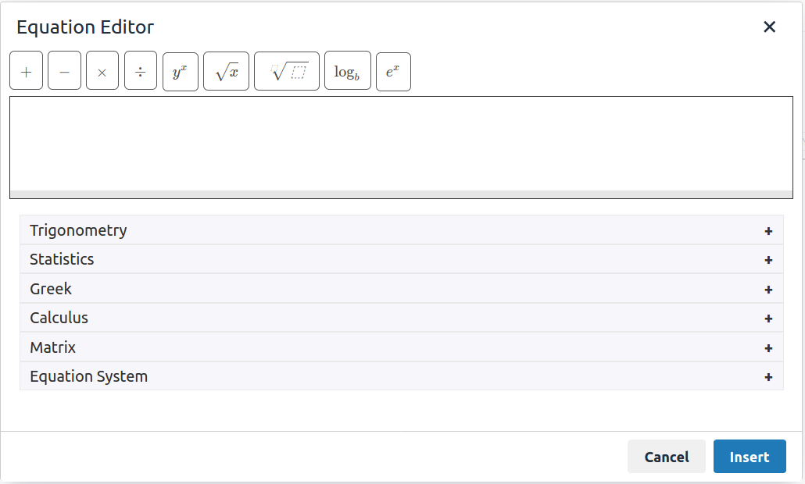

# TinyMCE Equation Editor

## What is this?

Equation Editor plugin for [TinyMCE](http://www.tinymce.com/) that uses [Mathquill](https://github.com/mathquill/mathquill).




## How do I use it?
Run the command:

```
node_modules/http-server/bin/http-server
```
And visit http://localhost:8080/src/demo/html/ to test the editor

## Usage
Move the folder `dist/mathquill-editor/` into TinyMCE plugin directory (`tinymce/plugins/`) and add the plugin in your TinyMCE configuration.

 ```html
<script type="text/javascript">
tinymce.init({
	selector: "textarea",
	plugins: ["mathquill-editor"],
	toolbar: "mathquill-editor",
	});
</script>
```

## Configuration
The configuration options for `mathquill-editor` plugin are:

 ```html
<script type="text/javascript">
tinymce.init({
	selector: "textarea",
	plugins: ["mathquill-editor"],
    toolbar: "mathquill-editor",
    mathquill_editor_config: {
        url = 'editor/equation_editor.html',
        origin = document.location.origin,
        title = 'Equation Editor',
        space_after_content = '&nbsp;',
        btn_cancel_text = 'Cancel',
        btn_ok_text = 'Insert',
    },
    mathquill_editor_group: 'basic',
    mathquill_editor_button_groups: {
        basic: [
                {
                    name: 'Numbers',
                    buttons: '1 2 3 4 \\pm \\dot',
                },
            ],
    },
    mathquill_editor_button_bar: '1 2 3 4 \\pm \\dot',
	});
</script>
```

For advanced buttons you can use an object of buttons in `mathquill_editor_button_groups`
```js
mathquill_editor_button_groups: {
    basic: [{
        name: 'Numbers',
        buttons: {
            {
                text: '0',
                cmd: false,
            },
            {
                text: '\\sqrt{x}',
                latex: '\\sqrt',
                cmd: true,
            },
        },
    },],
}
```
And also in `mathquill_editor_button_bar`
```js
mathquill_editor_button_bar: [
    {
        text: '0',
    },
    {
        text: '\\sqrt{x}',
        latex: '\\sqrt',
        cmd: true,
    }
]
```

## How do I contribute?


### Local Setup

Clone the repo:

`git clone git@github.com:your_github_username/mathquill_editor.git`
Run yarn: `yarn`


### Pull Requests

Please open your pull requests!

## Under the Covers